# ***Dynamic Routing Between Capsules***

Implementations of paper ***Dynamic Routing Between Capsules*** by Sara Sabour, Nicholas Frosst and 
Geoffrey E. Hinton.

Paper addr: http://www.cs.utoronto.ca/~hinton/absps/DynamicRouting.pdf

## Backgrounds
In this paper, authors propose a first full capsule networks inspired from Transforming Auto-Encoders.
A capsule is a group of neurons whose activity vector represents the instantiation
parameters of a specific type of entity such as an object or an object part. They use
the length of the activity vector to represent the probability that the entity exists and
its orientation to represent the instantiation parameters. Active capsules at one level
make predictions, via transformation matrices, for the instantiation parameters of
higher-level capsules. When multiple predictions agree, a higher level capsule
becomes active.

In this paper, capsule's definition does not change, in order to let capsule learn its instantiation,
routing-by-agreement algorithm is introduced, which is essentially a CLUSTERING algorithm and activation
function is simple squash function.

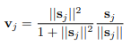

Between capsule i in the layer L and capsule j in the layer L+1, first, each capsule has to be transformed
into higher space using simple linear transformation matrix W, 

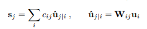

and use coefficient c to combine all capsules together who have the same clustering centriod 
in the above layer. 

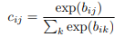

However, in order to get correct c, they use routing-by-agreement to find.

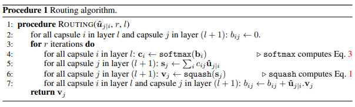

One can read paper carefully to understand how and why they design architecture like this.

And they also design new loss function, margin loss

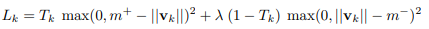

The whole architecture of CapsNet in this paper is:

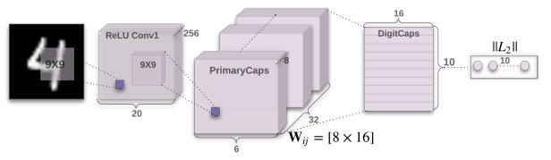

They also add reconstruction to address overfitting.

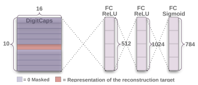

## Requirements

```Python
pip install -r requirements.txt 
```

## Implementation

We simply run MNIST and Fashion MNIST and CIFAR10(28 x 28 cropped) with little modified model.
In the model, we use `1e-3` to trade off reconstruction loss instead of `5e-4` in the paper,
also, we use `BCELoss` instead of `MSELoss` to compute reconstruction loss in the paper.
For CIFAR10, we use only one model instead of model ensemble strategy and we don't add 
'none-of-the-above' class. However, best result I can get from CIFAR10 is *70.25%* 
without any data augmentation.

### Hyper-parameters and defaults
```bash
--dataset = 'mnist' # 'mnist' or 'fashion_mnist'
--beta = 0.5 # hyper-parameter to trade off negative labels, default is 0.5
--epochs = 20 # number of epochs
--batch_size = 100 # number of batch size
```

### Train & Test

```python

python main.py main --beta=0.5 --epochs=20 --batch_size=32 --only_test=False --dataset='mnist'

```

## Results
| Dataset           | Acc.        |
| ----------------- | ----------- |
| MNIST      	    | 99.37%      |
| Fashion MNIST     | 90.95%      |

### MNIST

Reconstruction

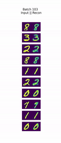

Manipulate capsules

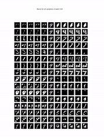

### Fashion MNIST

Reconstruction

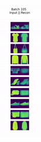

Manipulate capsules

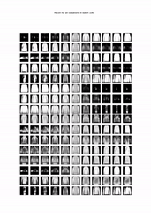


## Training statistics

### MNIST
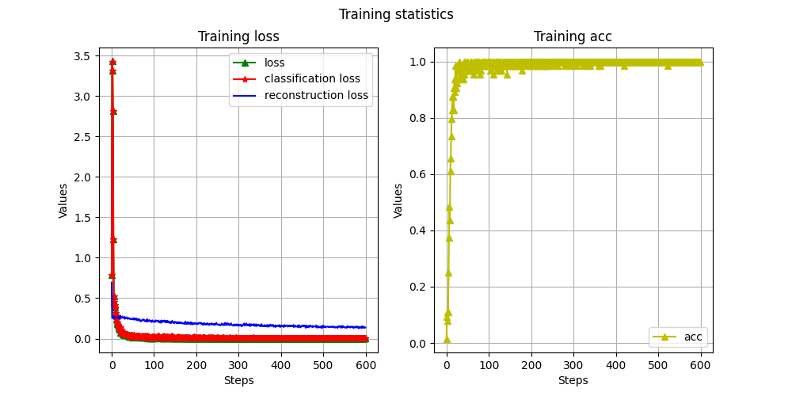

### Fashion MNIST
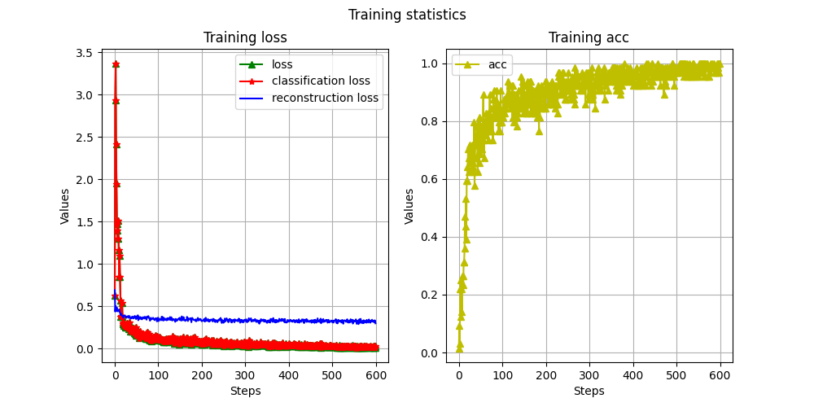


***<center>Veni，vidi，vici --Caesar</center>***
